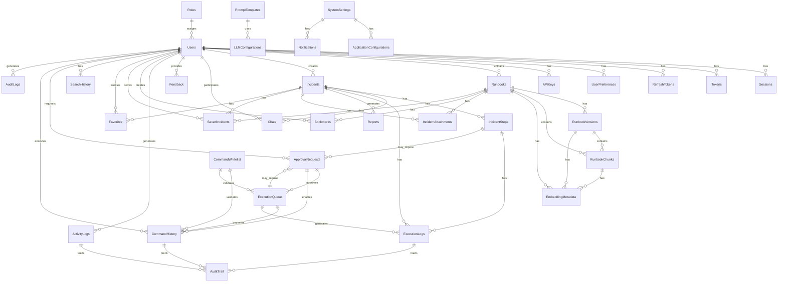
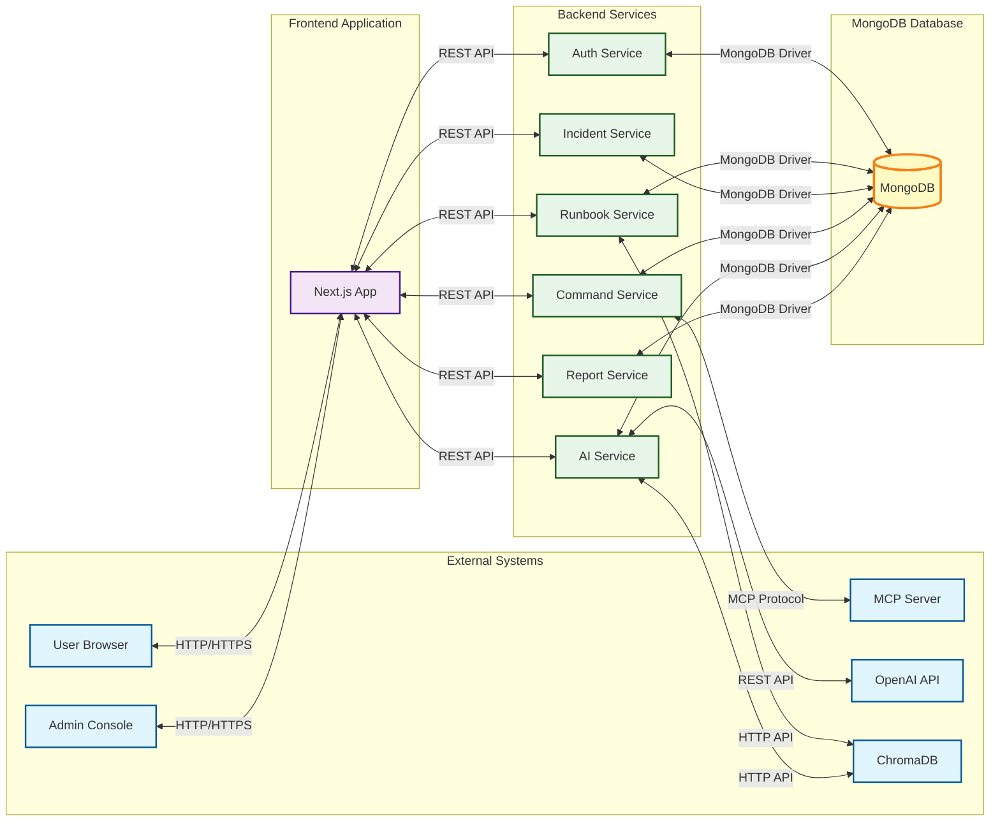
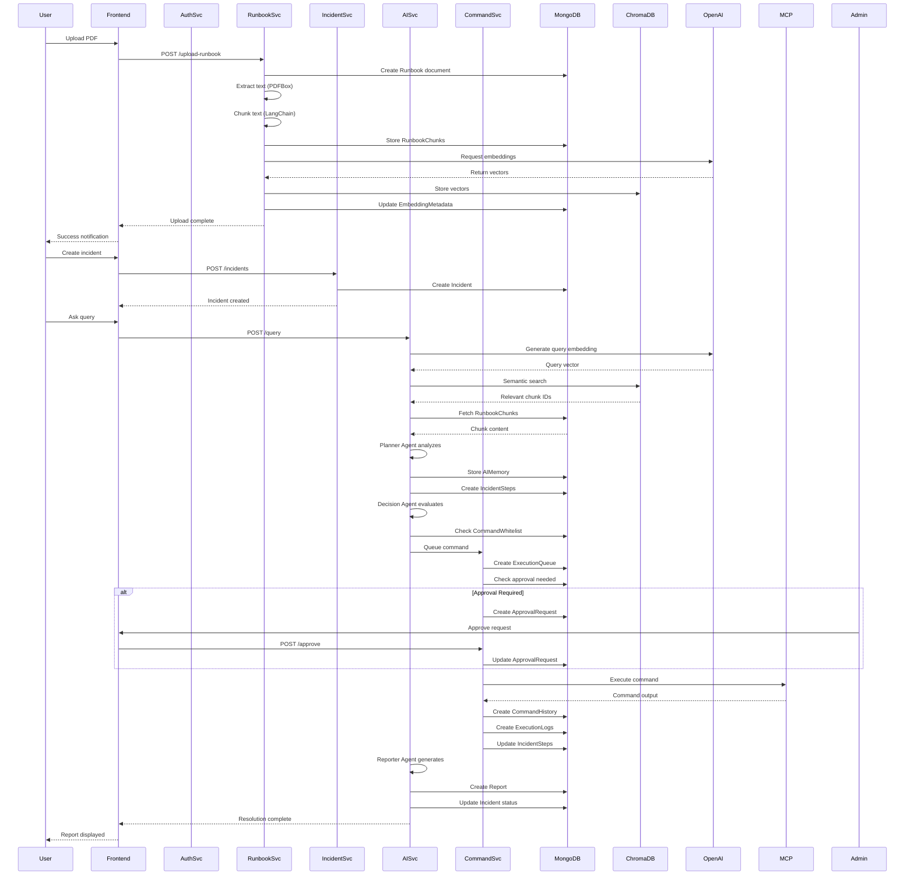

# Runbook Following Agent - Complete MongoDB Database Architecture

## Project Overview

**Project Name:** Runbook Following Agent  
**Project Type:** Enterprise AI Application  
**Database:** MongoDB (Existing Database)  
**Scale:** 100,000+ users, millions of incident logs  
**Architecture:** Enterprise-grade, microservice-friendly, scalable

---

# PHASE 1: COMPLETE ARCHITECTURE

## 1.1 Database Architecture Overview

```
┌─────────────────────────────────────────────────────────────────────────────┐
│                        MONGODB DATABASE ARCHITECTURE                        │
├─────────────────────────────────────────────────────────────────────────────┤
│                                                                             │
│  ┌─────────────────────────────────────────────────────────────────────┐   │
│  │                    AUTHENTICATION & AUTHORIZATION                    │   │
│  │  ┌──────────┐  ┌──────────┐  ┌──────────┐  ┌──────────┐           │   │
│  │  │  Users   │  │  Roles   │  │ Sessions │  │  Tokens  │           │   │
│  │  └──────────┘  └──────────┘  └──────────┘  └──────────┘           │   │
│  │  ┌──────────┐  ┌──────────┐  ┌──────────┐  ┌──────────┐           │   │
│  │  │RefreshTok│  │UserPref  │  │APIKeys   │  │AuditLogs │           │   │
│  │  └──────────┘  └──────────┘  └──────────┘  └──────────┘           │   │
│  └─────────────────────────────────────────────────────────────────────┘   │
│                                                                             │
│  ┌─────────────────────────────────────────────────────────────────────┐   │
│  │                         RUNBOOK MANAGEMENT                           │   │
│  │  ┌──────────┐  ┌──────────┐  ┌──────────┐  ┌──────────┐           │   │
│  │  │ Runbooks │  │RunbookVer│  │RunbookChu│  │EmbedMeta │           │   │
│  │  └──────────┘  └──────────┘  └──────────┘  └──────────┘           │   │
│  │  ┌──────────┐  ┌──────────┐  ┌──────────┐                            │   │
│  │  │IncidentAt│  │Bookmarks │  │SavedInc   │                            │   │
│  │  └──────────┘  └──────────┘  └──────────┘                            │   │
│  └─────────────────────────────────────────────────────────────────────┘   │
│                                                                             │
│  ┌─────────────────────────────────────────────────────────────────────┐   │
│  │                      INCIDENT MANAGEMENT                             │   │
│  │  ┌──────────┐  ┌──────────┐  ┌──────────┐  ┌──────────┐           │   │
│  │  │Incidents │  │IncidentSt│  │Chats     │  │AIMemory  │           │   │
│  │  └──────────┘  └──────────┘  └──────────┘  └──────────┘           │   │
│  │  ┌──────────┐  ┌──────────┐  ┌──────────┐                            │   │
│  │  │Feedback  │  │SearchHist│  │Favorites │                            │   │
│  │  └──────────┘  └──────────┘  └──────────┘                            │   │
│  └─────────────────────────────────────────────────────────────────────┘   │
│                                                                             │
│  ┌─────────────────────────────────────────────────────────────────────┐   │
│  │                    COMMAND EXECUTION & SECURITY                        │   │
│  │  ┌──────────┐  ┌──────────┐  ┌──────────┐  ┌──────────┐           │   │
│  │  │CmdWhite  │  │CmdHistory│  │ExecQueue │  │ApprovalR │           │   │
│  │  └──────────┘  └──────────┘  └──────────┘  └──────────┘           │   │
│  │  ┌──────────┐  ┌──────────┐  ┌──────────┐                            │   │
│  │  │ExecLogs  │  │AuditTrail│  │SystemLogs │                            │   │
│  │  └──────────┘  └──────────┘  └──────────┘                            │   │
│  └─────────────────────────────────────────────────────────────────────┘   │
│                                                                             │
│  ┌─────────────────────────────────────────────────────────────────────┐   │
│  │                        AI & AGENT SYSTEMS                             │   │
│  │  ┌──────────┐  ┌──────────┐  ┌──────────┐  ┌──────────┐           │   │
│  │  │PromptTem │  │LLMConfig │  │AIMemory  │  │Feedback  │           │   │
│  │  └──────────┘  └──────────┘  └──────────┘  └──────────┘           │   │
│  └─────────────────────────────────────────────────────────────────────┘   │
│                                                                             │
│  ┌─────────────────────────────────────────────────────────────────────┐   │
│  │                    REPORTING & ANALYTICS                              │   │
│  │  ┌──────────┐  ┌──────────┐  ┌──────────┐  ┌──────────┐           │   │
│  │  │ Reports  │  │Analytics │  │DashboardS│  │ActivityL │           │   │
│  │  └──────────┘  └──────────┘  └──────────┘  └──────────┘           │   │
│  │  ┌──────────┐  ┌──────────┐  ┌──────────┐                            │   │
│  │  │SystemHeal│  │ErrorLogs │  │SystemSet  │                            │   │
│  │  └──────────┘  └──────────┘  └──────────┘                            │   │
│  └─────────────────────────────────────────────────────────────────────┘   │
│                                                                             │
│  ┌─────────────────────────────────────────────────────────────────────┐   │
│  │                    SYSTEM CONFIGURATION                               │   │
│  │  ┌──────────┐  ┌──────────┐  ┌──────────┐  ┌──────────┐           │   │
│  │  │SystemSet │  │AppConfig │  │Notificat │  │AuditTrail│           │   │
│  │  └──────────┘  └──────────┘  └──────────┘  └──────────┘           │   │
│  └─────────────────────────────────────────────────────────────────────┘   │
│                                                                             │
└─────────────────────────────────────────────────────────────────────────────┘

                              CHROMADB (Vector Database)
┌─────────────────────────────────────────────────────────────────────────────┐
│  ┌─────────────────────────────────────────────────────────────────────┐   │
│  │                    VECTOR EMBEDDINGS STORAGE                         │   │
│  │  Collection: runbook_embeddings                                      │   │
│  │  - chunk_id (mapped to RunbookChunks._id)                           │   │
│  │  - embedding (1536-dim vector)                                       │   │
│  │  - metadata (runbook_id, chunk_index, tags)                          │   │
│  └─────────────────────────────────────────────────────────────────────┘   │
└─────────────────────────────────────────────────────────────────────────────┘
```

## 1.2 Collection Hierarchy

```
Level 1: Core Collections (Foundation)
├── Users
├── Roles
├── Sessions
├── Tokens
├── RefreshTokens
└── SystemSettings

Level 2: User Management
├── UserPreferences
├── APIKeys
├── ActivityLogs
└── AuditLogs

Level 3: Runbook Management
├── Runbooks
├── RunbookVersions
├── RunbookChunks
├── EmbeddingMetadata
├── IncidentAttachments
├── Bookmarks
├── SavedIncidents
└── Favorites

Level 4: Incident Management
├── Incidents
├── IncidentSteps
├── Chats
├── AIMemory
├── Feedback
└── SearchHistory

Level 5: Command Execution
├── CommandWhitelist
├── CommandHistory
├── ExecutionQueue
├── ApprovalRequests
├── ExecutionLogs
└── AuditTrail

Level 6: AI & Agent Systems
├── PromptTemplates
├── LLMConfigurations
├── AIMemory
└── Feedback

Level 7: Reporting & Analytics
├── Reports
├── Analytics
├── DashboardStatistics
├── ActivityLogs
├── ErrorLogs
├── SystemLogs
└── SystemHealth

Level 8: System Configuration
├── SystemSettings
├── ApplicationConfigurations
├── Notifications
└── AuditTrail
```

## 1.3 Database Relationship Diagram (Mermaid)



## 1.4 MongoDB Architecture Diagram

```
┌─────────────────────────────────────────────────────────────────────────────┐
│                          MONGODB CLUSTER ARCHITECTURE                        │
├─────────────────────────────────────────────────────────────────────────────┤
│                                                                             │
│  ┌─────────────────────────────────────────────────────────────────────┐   │
│  │                        SHARDING STRATEGY                            │   │
│  │                                                                      │   │
│  │  Shard Key: userId (for user-centric collections)                    │   │
│  │  Shard Key: runbookId (for runbook-centric collections)              │   │
│  │  Shard Key: incidentId (for incident-centric collections)           │   │
│  │  Shard Key: timestamp (for time-series collections)                  │   │
│  │                                                                      │   │
│  │  ┌──────────────┐  ┌──────────────┐  ┌──────────────┐              │   │
│  │  │   Shard 1    │  │   Shard 2    │  │   Shard 3    │              │   │
│  │  │  (Primary)   │  │  (Secondary) │  │  (Secondary) │              │   │
│  │  │  Users 0-33K │  │ Users 33-66K │  │ Users 66-100K│              │   │
│  │  └──────────────┘  └──────────────┘  └──────────────┘              │   │
│  └─────────────────────────────────────────────────────────────────────┘   │
│                                                                             │
│  ┌─────────────────────────────────────────────────────────────────────┐   │
│  │                        REPLICA SETS                                  │   │
│  │                                                                      │   │
│  │  RS-Primary (Write Operations)                                       │   │
│  │  RS-Secondary-1 (Read Operations)                                     │   │
│  │  RS-Secondary-2 (Read Operations + Backup)                           │   │
│  │  RS-Arbiter (Election)                                               │   │
│  │                                                                      │   │
│  └─────────────────────────────────────────────────────────────────────┘   │
│                                                                             │
│  ┌─────────────────────────────────────────────────────────────────────┐   │
│  │                        INDEXING STRATEGY                             │   │
│  │                                                                      │   │
│  │  - All foreign keys indexed                                          │   │
│  │  - All query fields indexed                                           │   │
│  │  - Compound indexes for common query patterns                        │   │
│  │  - Text indexes for search fields                                     │   │
│  │  - TTL indexes for time-based cleanup                                 │   │
│  │  - Unique indexes for unique constraints                              │   │
│  │                                                                      │   │
│  └─────────────────────────────────────────────────────────────────────┘   │
│                                                                             │
│  ┌─────────────────────────────────────────────────────────────────────┐   │
│  │                        TIME SERIES COLLECTIONS                       │   │
│  │                                                                      │   │
│  │  - ActivityLogs (bucketed by hour)                                    │   │
│  │  - ExecutionLogs (bucketed by hour)                                   │   │
│  │  - SystemLogs (bucketed by hour)                                      │   │
│  │  - ErrorLogs (bucketed by hour)                                       │   │
│  │  - AuditTrail (bucketed by hour)                                      │   │
│  │                                                                      │   │
│  └─────────────────────────────────────────────────────────────────────┘   │
│                                                                             │
│  ┌─────────────────────────────────────────────────────────────────────┐   │
│  │                        CACHING STRATEGY                             │   │
│  │                                                                      │   │
│  │  - Redis for session data                                             │   │
│  │  - MongoDB in-memory for hot data                                    │   │
│  │  - Application-level caching for frequently accessed data             │   │
│  │                                                                      │   │
│  └─────────────────────────────────────────────────────────────────────┘   │
│                                                                             │
└─────────────────────────────────────────────────────────────────────────────┘
```

## 1.5 Data Flow Diagram (RAG Pipeline)

```
┌─────────────────────────────────────────────────────────────────────────────┐
│                           RAG DATA FLOW                                    │
├─────────────────────────────────────────────────────────────────────────────┤
│                                                                             │
│  1. PDF UPLOAD                                                              │
│     ┌──────────┐                                                           │
│     │  User    │                                                           │
│     └────┬─────┘                                                           │
│          │                                                                  │
│          ▼                                                                  │
│     ┌──────────┐    Store metadata                                         │
│     │ Runbooks │─────────────────► MongoDB                                 │
│     └──────────┘                                                           │
│                                                                             │
│  2. TEXT EXTRACTION                                                         │
│     ┌──────────┐    Extract text                                            │
│     │ PDFBox   │─────────────────► Raw Text                                │
│     └──────────┘                                                           │
│                                                                             │
│  3. CLEANING & CHUNKING                                                     │
│     ┌──────────┐    Clean & chunk                                          │
│     │ LangChain│─────────────────► Chunks                                   │
│     └──────────┘                                                           │
│          │                                                                  │
│          ▼                                                                  │
│     ┌──────────────┐    Store chunks                                       │
│     │RunbookChunks │─────────────────► MongoDB                              │
│     └──────────────┘                                                           │
│                                                                             │
│  4. EMBEDDING GENERATION                                                    │
│     ┌──────────┐    Generate embeddings                                    │
│     │ OpenAI   │─────────────────► Vectors (1536-dim)                      │
│     └──────────┘                                                           │
│          │                                                                  │
│          ├─────────────────────────────────────────────────────────────┐   │
│          ▼                                                             │   │
│     ┌──────────────┐    Store metadata                                 │   │
│     │EmbeddingMeta │─────────────────► MongoDB                          │   │
│     └──────────────┘                                                      │   │
│          │                                                             │   │
│          ▼                                                             │   │
│     ┌──────────────┐    Store vectors                                 │   │
│     │  ChromaDB   │─────────────────► Vector Database                  │   │
│     └──────────────┘                                                      │   │
│                                                                             │
│  5. RETRIEVAL (Query Time)                                                  │
│     ┌──────────┐    User query                                            │
│     │  User    │                                                           │
│     └────┬─────┘                                                           │
│          │                                                                  │
│          ▼                                                                  │
│     ┌──────────┐    Generate query embedding                              │
│     │ OpenAI   │─────────────────► Query Vector                            │
│     └──────────┘                                                           │
│          │                                                                  │
│          ▼                                                                  │
│     ┌──────────────┐    Semantic search                                    │
│     │  ChromaDB   │─────────────────► Relevant Chunks                      │
│     └──────────────┘                                                           │
│          │                                                                  │
│          ▼                                                                  │
│     ┌──────────────┐    Retrieve full chunks                               │
│     │RunbookChunks │◄───────────────── MongoDB                             │
│     └──────────────┘                                                           │
│                                                                             │
│  6. AI AGENT PIPELINE                                                       │
│     ┌──────────────┐                                                       │
│     │ Planner Agent │    Analyze context, plan steps                       │
│     └──────┬───────┘                                                       │
│            │                                                                │
│            ▼                                                                │
│     ┌──────────────┐                                                       │
│     │Decision Agent │    Evaluate risk, check whitelist                    │
│     └──────┬───────┘                                                       │
│            │                                                                │
│            ▼                                                                │
│     ┌──────────────┐                                                       │
│     │Executor Agent│    Execute commands via MCP                           │
│     └──────┬───────┘                                                       │
│            │                                                                │
│            ▼                                                                │
│     ┌──────────────┐                                                       │
│     │Reporter Agent │    Generate report, save to MongoDB                  │
│     └──────────────┘                                                       │
│                                                                             │
│  MONGODB STORES:                                                            │
│  - Runbook metadata (Runbooks, RunbookVersions)                            │
│  - Chunk text and metadata (RunbookChunks)                                  │
│  - Embedding metadata (EmbeddingMetadata)                                   │
│  - Incident data (Incidents, IncidentSteps)                                 │
│  - Execution logs (ExecutionLogs, CommandHistory)                           │
│  - Agent memory (AIMemory)                                                  │
│  - Reports (Reports)                                                        │
│                                                                             │
│  CHROMADB STORES:                                                           │
│  - Vector embeddings only (1536-dim vectors)                                │
│  - Minimal metadata (chunk_id, runbook_id, chunk_index, tags)              │
│  - No text duplication (text stored in MongoDB)                            │
│                                                                             │
└─────────────────────────────────────────────────────────────────────────────┘
```

## 1.6 AI Agent Database Design

```
┌─────────────────────────────────────────────────────────────────────────────┐
│                        AI AGENT COLLECTIONS                                 │
├─────────────────────────────────────────────────────────────────────────────┤
│                                                                             │
│  PLANNER AGENT                                                              │
│  ┌─────────────────────────────────────────────────────────────────────┐   │
│  │  Collections:                                                       │   │
│  │  - AIMemory (stores planning context, reasoning chains)             │   │
│  │  - PromptTemplates (planner-specific prompts)                       │   │
│  │  - Incidents (stores planned steps)                                  │   │
│  │  - IncidentSteps (detailed step breakdown)                            │   │
│  └─────────────────────────────────────────────────────────────────────┘   │
│                                                                             │
│  EXECUTION AGENT                                                            │
│  ┌─────────────────────────────────────────────────────────────────────┐   │
│  │  Collections:                                                       │   │
│  │  - ExecutionQueue (pending commands)                                │   │
│  │  - ExecutionLogs (execution results)                                 │   │
│  │  - CommandHistory (command audit trail)                              │   │
│  │  - ApprovalRequests (approval workflow)                              │   │
│  │  - CommandWhitelist (allowed commands)                               │   │
│  └─────────────────────────────────────────────────────────────────────┘   │
│                                                                             │
│  DECISION AGENT                                                             │
│  ┌─────────────────────────────────────────────────────────────────────┐   │
│  │  Collections:                                                       │   │
│  │  - CommandWhitelist (risk assessment)                                │   │
│  │  - ApprovalRequests (decision records)                               │   │
│  │  - AIMemory (decision context)                                        │   │
│  │  - SystemSettings (risk thresholds)                                  │   │
│  └─────────────────────────────────────────────────────────────────────┘   │
│                                                                             │
│  REPORTER AGENT                                                             │
│  ┌─────────────────────────────────────────────────────────────────────┐   │
│  │  Collections:                                                       │   │
│  │  - Reports (generated reports)                                        │   │
│  │  - ExecutionLogs (source data)                                       │   │
│  │  - Incidents (incident context)                                       │   │
│  │  - Analytics (report metrics)                                         │   │
│  └─────────────────────────────────────────────────────────────────────┘   │
│                                                                             │
│  MEMORY AGENT                                                               │
│  ┌─────────────────────────────────────────────────────────────────────┐   │
│  │  Collections:                                                       │   │
│  │  - AIMemory (agent memory, context, learnings)                       │   │
│  │  - Chats (conversation history)                                      │   │
│  │  - Feedback (user feedback for learning)                              │   │
│  │  - SearchHistory (query patterns)                                    │   │
│  └─────────────────────────────────────────────────────────────────────┘   │
│                                                                             │
└─────────────────────────────────────────────────────────────────────────────┘
```

## 1.7 Security Architecture

```
┌─────────────────────────────────────────────────────────────────────────────┐
│                        SECURITY ARCHITECTURE                                │
├─────────────────────────────────────────────────────────────────────────────┤
│                                                                             │
│  AUTHENTICATION                                                             │
│  ┌─────────────────────────────────────────────────────────────────────┐   │
│  │  - Users (password hashes with BCrypt)                                │   │
│  │  - Sessions (active session tracking)                                  │   │
│  │  - Tokens (JWT access tokens)                                          │   │
│  │  - RefreshTokens (JWT refresh tokens)                                  │   │
│  │  - ActivityLogs (login/logout tracking)                                │   │
│  │  - Failed login attempts tracked in Users                              │   │
│  └─────────────────────────────────────────────────────────────────────┘   │
│                                                                             │
│  AUTHORIZATION                                                              │
│  ┌─────────────────────────────────────────────────────────────────────┐   │
│  │  - Roles (role definitions)                                           │   │
│  │  - Users (role assignments)                                            │   │
│  │  - CommandWhitelist (role-based command access)                        │   │
│  │  - ApprovalRequests (role-based approval workflow)                     │   │
│  └─────────────────────────────────────────────────────────────────────┘   │
│                                                                             │
│  AUDIT & COMPLIANCE                                                        │
│  ┌─────────────────────────────────────────────────────────────────────┐   │
│  │  - AuditLogs (all CRUD operations)                                    │   │
│  │  - AuditTrail (comprehensive audit trail)                             │   │
│  │  - ActivityLogs (user activities)                                      │   │
│  │  - CommandHistory (command execution audit)                            │   │
│  │  - ExecutionLogs (detailed execution records)                         │   │
│  └─────────────────────────────────────────────────────────────────────┘   │
│                                                                             │
│  DATA PROTECTION                                                            │
│  ┌─────────────────────────────────────────────────────────────────────┐   │
│  │  - Soft delete on all major collections (deletedAt field)             │   │
│  │  - Sensitive fields marked for encryption                             │   │
│  │  - APIKeys (encrypted storage)                                        │   │
│  │  - UserPreferences (privacy settings)                                 │   │
│  │  - PII tracking in AuditLogs                                          │   │
│  └─────────────────────────────────────────────────────────────────────┘   │
│                                                                             │
│  SESSION MANAGEMENT                                                         │
│  ┌─────────────────────────────────────────────────────────────────────┐   │
│  │  - Sessions (session tracking)                                        │   │
│  │  - Tokens (JWT with expiration)                                       │   │
│  │  - RefreshTokens (secure refresh mechanism)                           │   │
│  │  - ActivityLogs (session activity)                                    │   │
│  │  - Failed login attempt lockout (Users.failedLoginAttempts)          │   │
│  └─────────────────────────────────────────────────────────────────────┘   │
│                                                                             │
└─────────────────────────────────────────────────────────────────────────────┘
```

## 1.8 Scalability Considerations

```
┌─────────────────────────────────────────────────────────────────────────────┐
│                      SCALABILITY ARCHITECTURE                               │
├─────────────────────────────────────────────────────────────────────────────┤
│                                                                             │
│  HORIZONTAL SCALING                                                         │
│  ┌─────────────────────────────────────────────────────────────────────┐   │
│  │  - Sharding by userId for user-centric collections                    │   │
│  │  - Sharding by runbookId for runbook collections                       │   │
│  │  - Sharding by incidentId for incident collections                     │   │
│  │  - Time series collections for logs (bucketed by time)                 │   │
│  └─────────────────────────────────────────────────────────────────────┘   │
│                                                                             │
│  VERTICAL SCALING                                                           │
│  ┌─────────────────────────────────────────────────────────────────────┐   │
│  │  - Read replicas for query scaling                                     │   │
│  │  - Dedicated config servers                                            │   │
│  │  - Separate mongos instances                                           │   │
│  └─────────────────────────────────────────────────────────────────────┘   │
│                                                                             │
│  DATA ARCHIVAL                                                              │
│  ┌─────────────────────────────────────────────────────────────────────┐   │
│  │  - TTL indexes on ActivityLogs (90 days)                             │   │
│  │  - TTL indexes on ExecutionLogs (180 days)                           │   │
│  │  - TTL indexes on SystemLogs (30 days)                                │   │
│  │  - TTL indexes on ErrorLogs (90 days)                                 │   │
│  │  - Cold storage for old data                                          │   │
│  └─────────────────────────────────────────────────────────────────────┘   │
│                                                                             │
│  PERFORMANCE OPTIMIZATION                                                   │
│  ┌─────────────────────────────────────────────────────────────────────┐   │
│  │  - Comprehensive indexing strategy                                   │   │
│  │  - Query optimization with covered queries                             │   │
│  │  - Aggregation pipeline optimization                                   │   │
│  │  - Connection pooling                                                  │   │
│  │  - Read concern: majority for critical reads                           │   │
│  │  - Write concern: majority for critical writes                         │   │
│  └─────────────────────────────────────────────────────────────────────┘   │
│                                                                             │
│  CAPACITY PLANNING                                                          │
│  ┌─────────────────────────────────────────────────────────────────────┐   │
│  │  - 100,000 users                                                      │   │
│  │  - 1M+ runbooks                                                       │   │
│  │  - 10M+ runbook chunks                                                │   │
│  │  - 100M+ embeddings in ChromaDB                                        │   │
│  │  - 1M+ incidents                                                      │   │
│  │  - 10M+ incident steps                                                 │   │
│  │  - 100M+ execution logs                                                │   │
│  │  - 1B+ audit log entries                                               │   │
│  └─────────────────────────────────────────────────────────────────────┘   │
│                                                                             │
└─────────────────────────────────────────────────────────────────────────────┘
```

---

*Phase 1 Complete. Proceeding to Phase 2...*

---

# PHASE 2: ER DIAGRAM AND DATA FLOW DIAGRAM

## 2.1 Detailed Entity Relationship Diagram (ERD)

```mermaid
erDiagram
    %% Core User Management
    Users {
        ObjectId _id PK
        String username UK
        String email UK
        String passwordHash
        String firstName
        String lastName
        String roleId FK
        Boolean isActive
        Boolean isEmailVerified
        DateTime lastLoginAt
        Integer failedLoginAttempts
        DateTime lockedUntil
        DateTime createdAt
        DateTime updatedAt
        DateTime deletedAt
    }
    
    Roles {
        ObjectId _id PK
        String name UK
        String description
        Array permissions
        DateTime createdAt
        DateTime updatedAt
    }
    
    Sessions {
        ObjectId _id PK
        ObjectId userId FK
        String token
        String ipAddress
        String userAgent
        DateTime expiresAt
        DateTime createdAt
    }
    
    Tokens {
        ObjectId _id PK
        ObjectId userId FK
        String token
        String type
        DateTime expiresAt
        DateTime createdAt
    }
    
    RefreshTokens {
        ObjectId _id PK
        ObjectId userId FK
        String token
        String refreshToken
        DateTime expiresAt
        DateTime createdAt
        Boolean isRevoked
    }
    
    UserPreferences {
        ObjectId _id PK
        ObjectId userId FK
        Object theme
        Object notifications
        Object privacy
        DateTime createdAt
        DateTime updatedAt
    }
    
    APIKeys {
        ObjectId _id PK
        ObjectId userId FK
        String name
        String keyHash
        Array scopes
        DateTime expiresAt
        DateTime lastUsedAt
        Boolean isActive
        DateTime createdAt
        DateTime updatedAt
    }
    
    %% Runbook Management
    Runbooks {
        ObjectId _id PK
        String title
        String description
        ObjectId uploadedBy FK
        String originalFileName
        String fileName
        String fileType
        Long fileSize
        String fileHash
        String checksum
        String storagePath
        Integer version
        String status
        String processingStatus
        String parserStatus
        Integer chunkCount
        String embeddingStatus
        Array vectorIds
        DateTime uploadedAt
        DateTime processedAt
        DateTime createdAt
        DateTime updatedAt
        DateTime deletedAt
    }
    
    RunbookVersions {
        ObjectId _id PK
        ObjectId runbookId FK
        Integer versionNumber
        String title
        String description
        ObjectId uploadedBy FK
        String originalFileName
        String fileName
        String fileType
        Long fileSize
        String fileHash
        String checksum
        String storagePath
        String status
        DateTime uploadedAt
        DateTime createdAt
    }
    
    RunbookChunks {
        ObjectId _id PK
        ObjectId runbookId FK
        ObjectId versionId FK
        Integer chunkIndex
        String content
        Integer startPosition
        Integer endPosition
        Array tags
        String section
        Integer tokenCount
        String embeddingId
        DateTime createdAt
    }
    
    EmbeddingMetadata {
        ObjectId _id PK
        ObjectId runbookId FK
        ObjectId versionId FK
        ObjectId chunkId FK
        String embeddingModel
        Integer embeddingDimension
        String vectorId
        DateTime generatedAt
        DateTime createdAt
    }
    
    IncidentAttachments {
        ObjectId _id PK
        ObjectId incidentId FK
        ObjectId runbookId FK
        String fileName
        String originalFileName
        String fileType
        Long fileSize
        String storagePath
        DateTime uploadedAt
        DateTime createdAt
    }
    
    Bookmarks {
        ObjectId _id PK
        ObjectId userId FK
        ObjectId runbookId FK
        String title
        String notes
        DateTime createdAt
        DateTime updatedAt
    }
    
    SavedIncidents {
        ObjectId _id PK
        ObjectId userId FK
        ObjectId incidentId FK
        String title
        String notes
        DateTime createdAt
        DateTime updatedAt
    }
    
    Favorites {
        ObjectId _id PK
        ObjectId userId FK
        ObjectId targetType FK
        ObjectId targetId FK
        DateTime createdAt
    }
    
    %% Incident Management
    Incidents {
        ObjectId _id PK
        String title
        String description
        ObjectId createdBy FK
        ObjectId runbookId FK
        String severity
        String status
        String category
        Array tags
        DateTime startedAt
        DateTime resolvedAt
        DateTime createdAt
        DateTime updatedAt
        DateTime deletedAt
    }
    
    IncidentSteps {
        ObjectId _id PK
        ObjectId incidentId FK
        Integer stepNumber
        String title
        String description
        String command
        String expectedOutput
        String actualOutput
        String status
        Boolean requiresApproval
        ObjectId approvedBy FK
        DateTime approvedAt
        DateTime executedAt
        DateTime createdAt
        DateTime updatedAt
    }
    
    Chats {
        ObjectId _id PK
        ObjectId incidentId FK
        ObjectId userId FK
        String role
        String content
        Array citations
        DateTime createdAt
    }
    
    AIMemory {
        ObjectId _id PK
        ObjectId incidentId FK
        ObjectId userId FK
        String agentType
        String memoryType
        Object content
        Integer importance
        DateTime expiresAt
        DateTime createdAt
    }
    
    Feedback {
        ObjectId _id PK
        ObjectId incidentId FK
        ObjectId userId FK
        ObjectId stepId FK
        Integer rating
        String comment
        String category
        DateTime createdAt
    }
    
    SearchHistory {
        ObjectId _id PK
        ObjectId userId FK
        String query
        Array results
        Integer resultCount
        DateTime createdAt
    }
    
    %% Command Execution
    CommandWhitelist {
        ObjectId _id PK
        String command
        String pattern
        String description
        String riskLevel
        Array allowedRoles
        Boolean requiresApproval
        DateTime createdAt
        DateTime updatedAt
    }
    
    CommandHistory {
        ObjectId _id PK
        ObjectId incidentId FK
        ObjectId stepId FK
        ObjectId userId FK
        String command
        String machineId
        String riskLevel
        String status
        String output
        String error
        Integer exitCode
        DateTime executedAt
        DateTime duration
        DateTime createdAt
    }
    
    ExecutionQueue {
        ObjectId _id PK
        ObjectId incidentId FK
        ObjectId stepId FK
        ObjectId userId FK
        String command
        String machineId
        String riskLevel
        String status
        Integer priority
        DateTime scheduledAt
        DateTime startedAt
        DateTime completedAt
        DateTime createdAt
    }
    
    ApprovalRequests {
        ObjectId _id PK
        ObjectId executionQueueId FK
        ObjectId incidentId FK
        ObjectId stepId FK
        ObjectId requestedBy FK
        ObjectId approvedBy FK
        String command
        String riskLevel
        String status
        String reason
        DateTime requestedAt
        DateTime reviewedAt
        DateTime createdAt
    }
    
    ExecutionLogs {
        ObjectId _id PK
        ObjectId incidentId FK
        ObjectId stepId FK
        ObjectId commandHistoryId FK
        String logType
        String level
        String message
        Object metadata
        DateTime timestamp
        DateTime createdAt
    }
    
    AuditTrail {
        ObjectId _id PK
        ObjectId userId FK
        String action
        String entityType
        ObjectId entityId
        Object changes
        String ipAddress
        DateTime createdAt
    }
    
    %% AI & Agent Systems
    PromptTemplates {
        ObjectId _id PK
        String name
        String description
        String agentType
        String template
        Object variables
        DateTime createdAt
        DateTime updatedAt
    }
    
    LLMConfigurations {
        ObjectId _id PK
        String name
        String provider
        String model
        Object parameters
        Integer maxTokens
        Float temperature
        DateTime createdAt
        DateTime updatedAt
    }
    
    %% Reporting & Analytics
    Reports {
        ObjectId _id PK
        ObjectId incidentId FK
        ObjectId createdBy FK
        String title
        String type
        Object content
        String format
        DateTime generatedAt
        DateTime createdAt
    }
    
    Analytics {
        ObjectId _id PK
        String metric
        Object dimensions
        Float value
        DateTime timestamp
        DateTime createdAt
    }
    
    DashboardStatistics {
        ObjectId _id PK
        String category
        Object statistics
        DateTime periodStart
        DateTime periodEnd
        DateTime calculatedAt
        DateTime createdAt
    }
    
    ActivityLogs {
        ObjectId _id PK
        ObjectId userId FK
        String action
        String entityType
        ObjectId entityId
        Object details
        DateTime timestamp
        DateTime createdAt
    }
    
    ErrorLogs {
        ObjectId _id PK
        ObjectId userId FK
        String errorType
        String errorMessage
        String stackTrace
        Object context
        DateTime timestamp
        DateTime createdAt
    }
    
    SystemLogs {
        ObjectId _id PK
        String level
        String component
        String message
        Object metadata
        DateTime timestamp
        DateTime createdAt
    }
    
    SystemHealth {
        ObjectId _id PK
        String component
        String status
        Object metrics
        DateTime timestamp
        DateTime createdAt
    }
    
    %% System Configuration
    SystemSettings {
        ObjectId _id PK
        String key UK
        String value
        String type
        String category
        String description
        DateTime updatedAt
    }
    
    ApplicationConfigurations {
        ObjectId _id PK
        String key UK
        Object value
        String category
        String description
        DateTime updatedAt
    }
    
    Notifications {
        ObjectId _id PK
        ObjectId userId FK
        String type
        String title
        String message
        Object data
        Boolean isRead
        DateTime readAt
        DateTime expiresAt
        DateTime createdAt
    }
    
    %% Relationships
    Users ||--o{ Roles : "has"
    Users ||--o{ Sessions : "has"
    Users ||--o{ Tokens : "has"
    Users ||--o{ RefreshTokens : "has"
    Users ||--o{ UserPreferences : "has"
    Users ||--o{ APIKeys : "has"
    Users ||--o{ Runbooks : "uploads"
    Users ||--o{ Incidents : "creates"
    Users ||--o{ Chats : "participates"
    Users ||--o{ Feedback : "provides"
    Users ||--o{ ActivityLogs : "generates"
    Users ||--o{ Bookmarks : "creates"
    Users ||--o{ SavedIncidents : "saves"
    Users ||--o{ Favorites : "creates"
    Users ||--o{ SearchHistory : "has"
    Users ||--o{ ApprovalRequests : "requests"
    Users ||--o{ ApprovalRequests : "approves"
    Users ||--o{ CommandHistory : "executes"
    Users ||--o{ AuditTrail : "generates"
    Users ||--o{ ErrorLogs : "generates"
    Users ||--o{ Notifications : "receives"
    
    Roles ||--o{ Users : "assigns"
    
    Runbooks ||--o{ RunbookVersions : "has"
    Runbooks ||--o{ RunbookChunks : "contains"
    Runbooks ||--o{ EmbeddingMetadata : "has"
    Runbooks ||--o{ IncidentAttachments : "has"
    Runbooks ||--o{ Bookmarks : "has"
    Runbooks ||--o{ SavedIncidents : "has"
    Runbooks ||--o{ Incidents : "references"
    
    RunbookVersions ||--o{ RunbookChunks : "contains"
    RunbookVersions ||--o{ EmbeddingMetadata : "has"
    
    RunbookChunks ||--o{ EmbeddingMetadata : "has"
    
    Incidents ||--o{ IncidentSteps : "has"
    Incidents ||--o{ Chats : "has"
    Incidents ||--o{ ExecutionLogs : "has"
    Incidents ||--o{ Reports : "generates"
    Incidents ||--o{ IncidentAttachments : "has"
    Incidents ||--o{ SavedIncidents : "has"
    Incidents ||--o{ Favorites : "has"
    Incidents ||--o{ AIMemory : "has"
    Incidents ||--o{ Feedback : "receives"
    
    IncidentSteps ||--o{ ExecutionLogs : "has"
    IncidentSteps ||--o{ ApprovalRequests : "may_require"
    IncidentSteps ||--o{ CommandHistory : "executes"
    IncidentSteps ||--o{ Feedback : "receives"
    
    CommandWhitelist ||--o{ CommandHistory : "validates"
    CommandWhitelist ||--o{ ExecutionQueue : "validates"
    
    ExecutionQueue ||--o{ CommandHistory : "becomes"
    ExecutionQueue ||--o{ ApprovalRequests : "may_require"
    ExecutionQueue ||--o{ ExecutionLogs : "generates"
    
    ApprovalRequests ||--o{ ExecutionQueue : "approves"
    ApprovalRequests ||--o{ CommandHistory : "enables"
    
    PromptTemplates ||--o{ LLMConfigurations : "uses"
    
    SystemSettings ||--o{ ApplicationConfigurations : "has"
```



## 2.2 Detailed Data Flow Diagram (DFD)

```mermaid
flowchart TD
    %% External Entities
    User[User]
    Admin[Admin]
    System[System]
    
    %% Authentication Flow
    subgraph AUTH ["Authentication Module"]
        Login[POST /login]
        Register[POST /register]
        Logout[POST /logout]
        Refresh[POST /refresh-token]
    end
    
    %% Runbook Upload Flow
    subgraph RUNBOOK ["Runbook Management"]
        Upload[POST /upload-runbook]
        Process[Process PDF]
        Chunk[Chunk Text]
        Embed[Generate Embeddings]
        StoreMeta[Store Metadata]
        StoreVector[Store Vectors]
    end
    
    %% Incident Management Flow
    subgraph INCIDENT ["Incident Management"]
        CreateIncident[POST /incidents]
        Query[RAG Query]
        Retrieve[Retrieve Chunks]
        Plan[Plan Steps]
        Execute[Execute Commands]
        GenerateReport[Generate Report]
    end
    
    %% Command Execution Flow
    subgraph COMMAND ["Command Execution"]
        Validate[Validate Command]
        CheckRisk[Check Risk Level]
        RequestApproval[Request Approval]
        ExecuteCmd[Execute Command]
        LogResult[Log Result]
    end
    
    %% AI Agent Flow
    subgraph AI ["AI Agents"]
        Planner[Planner Agent]
        Decision[Decision Agent]
        Executor[Executor Agent]
        Reporter[Reporter Agent]
        Memory[Memory Agent]
    end
    
    %% Database Collections
    subgraph DB ["MongoDB Collections"]
        Users[Users]
        Roles[Roles]
        Sessions[Sessions]
        Tokens[Tokens]
        RefreshTokens[RefreshTokens]
        Runbooks[Runbooks]
        RunbookVersions[RunbookVersions]
        RunbookChunks[RunbookChunks]
        EmbeddingMetadata[EmbeddingMetadata]
        Incidents[Incidents]
        IncidentSteps[IncidentSteps]
        Chats[Chats]
        AIMemory[AIMemory]
        CommandWhitelist[CommandWhitelist]
        CommandHistory[CommandHistory]
        ExecutionQueue[ExecutionQueue]
        ApprovalRequests[ApprovalRequests]
        ExecutionLogs[ExecutionLogs]
        Reports[Reports]
        AuditLogs[AuditLogs]
        ActivityLogs[ActivityLogs]
    end
    
    subgraph VECTOR ["ChromaDB"]
        Chroma[runbook_embeddings]
    end
    
    %% Authentication Flow Connections
    User -->|credentials| Login
    Login -->|validate| Users
    Login -->|create| Sessions
    Login -->|generate| Tokens
    Login -->|generate| RefreshTokens
    Login -->|log| ActivityLogs
    Login -->|audit| AuditLogs
    
    User -->|register| Register
    Register -->|create| Users
    Register -->|assign| Roles
    
    User -->|logout| Logout
    Logout -->|delete| Sessions
    Logout -->|log| ActivityLogs
    
    User -->|refresh| Refresh
    Refresh -->|validate| RefreshTokens
    Refresh -->|generate| Tokens
    
    %% Runbook Upload Flow Connections
    User -->|upload file| Upload
    Upload -->|store metadata| Runbooks
    Upload -->|create version| RunbookVersions
    Upload -->|log| ActivityLogs
    Upload -->|audit| AuditLogs
    
    Upload -->|extract text| Process
    Process -->|chunk| Chunk
    Chunk -->|store| RunbookChunks
    Chunk -->|log| ActivityLogs
    
    Chunk -->|generate| Embed
    Embed -->|store metadata| EmbeddingMetadata
    Embed -->|store vectors| Chroma
    Embed -->|update| Runbooks
    
    %% Incident Management Flow Connections
    User -->|create incident| CreateIncident
    CreateIncident -->|store| Incidents
    CreateIncident -->|log| ActivityLogs
    
    User -->|query| Query
    Query -->|generate embedding| Embed
    Embed -->|search| Chroma
    Chroma -->|return chunk IDs| Retrieve
    Retrieve -->|fetch chunks| RunbookChunks
    Retrieve -->|return| Planner
    
    Planner -->|plan steps| Plan
    Plan -->|store steps| IncidentSteps
    Plan -->|store memory| AIMemory
    
    Plan -->|execute| Execute
    Execute -->|add to queue| ExecutionQueue
    ExecutionQueue -->|validate| Validate
    Validate -->|check whitelist| CommandWhitelist
    Validate -->|check risk| CheckRisk
    
    CheckRisk -->|high risk| RequestApproval
    RequestApproval -->|store| ApprovalRequests
    Admin -->|approve| ApprovalRequests
    ApprovalRequests -->|approved| ExecuteCmd
    
    CheckRisk -->|low risk| ExecuteCmd
    ExecuteCmd -->|execute| ExecuteCmd
    ExecuteCmd -->|log| CommandHistory
    ExecuteCmd -->|log| ExecutionLogs
    ExecuteCmd -->|update| IncidentSteps
    
    Execute -->|complete| GenerateReport
    GenerateReport -->|store| Reports
    GenerateReport -->|update| Incidents
    
    %% AI Agent Connections
    Planner -->|use memory| AIMemory
    Decision -->|check whitelist| CommandWhitelist
    Executor -->|execute commands| CommandHistory
    Reporter -->|generate reports| Reports
    Memory -->|store context| AIMemory
    Memory -->|store learnings| AIMemory
    
    %% Audit Logging
    Users -->|changes| AuditLogs
    Runbooks -->|changes| AuditLogs
    Incidents -->|changes| AuditLogs
    CommandHistory -->|changes| AuditLogs
    
    %% Activity Logging
    User -->|actions| ActivityLogs
    System -->|actions| ActivityLogs
    
    %% Styling
    classDef user fill:#e1f5ff,stroke:#01579b,stroke-width:2px
    classDef auth fill:#fff3e0,stroke:#e65100,stroke-width:2px
    classDef runbook fill:#f3e5f5,stroke:#4a148c,stroke-width:2px
    classDef incident fill:#e8f5e9,stroke:#1b5e20,stroke-width:2px
    classDef command fill:#ffebee,stroke:#b71c1c,stroke-width:2px
    classDef ai fill:#e0f2f1,stroke:#00695c,stroke-width:2px
    classDef db fill:#fff9c4,stroke:#f57f17,stroke-width:2px
    classDef vector fill:#fce4ec,stroke:#880e4f,stroke-width:2px
    
    class User,Admin,System user
    class Login,Register,Logout,Refresh auth
    class Upload,Process,Chunk,Embed,StoreMeta,StoreVector runbook
    class CreateIncident,Query,Retrieve,Plan,Execute,GenerateReport incident
    class Validate,CheckRisk,RequestApproval,ExecuteCmd,LogResult command
    class Planner,Decision,Executor,Reporter,Memory ai
    class Users,Roles,Sessions,Tokens,RefreshTokens,Runbooks,RunbookVersions,RunbookChunks,EmbeddingMetadata,Incidents,IncidentSteps,Chats,AIMemory,CommandWhitelist,CommandHistory,ExecutionQueue,ApprovalRequests,ExecutionLogs,Reports,AuditLogs,ActivityLogs db
    class Chroma vector
```



## 2.3 System Context Diagram



## 2.4 Component Interaction Diagram



---

*Phase 2 Complete. Proceeding to Phase 3...*

---

# PHASE 3: COMPLETE COLLECTION LIST AND DEPENDENCY GRAPH

## 3.1 Complete Collection List (40 Collections)

### Core Collections (8)
1. **Users** - User accounts and authentication
2. **Roles** - Role definitions and permissions
3. **Sessions** - Active user sessions
4. **Tokens** - JWT access tokens
5. **RefreshTokens** - JWT refresh tokens
6. **UserPreferences** - User settings and preferences
7. **APIKeys** - API key management
8. **SystemSettings** - System-wide configuration

### Runbook Management Collections (8)
9. **Runbooks** - Runbook metadata and file information
10. **RunbookVersions** - Version history for runbooks
11. **RunbookChunks** - Text chunks from runbooks
12. **EmbeddingMetadata** - Embedding generation metadata
13. **IncidentAttachments** - File attachments for incidents
14. **Bookmarks** - User bookmarks for runbooks
15. **SavedIncidents** - User-saved incidents
16. **Favorites** - User favorites (runbooks, incidents, etc.)

### Incident Management Collections (6)
17. **Incidents** - Incident records
18. **IncidentSteps** - Step-by-step incident resolution
19. **Chats** - Chat conversations within incidents
20. **AIMemory** - AI agent memory storage
21. **Feedback** - User feedback on incidents/steps
22. **SearchHistory** - User search query history

### Command Execution Collections (6)
23. **CommandWhitelist** - Allowed command patterns
24. **CommandHistory** - Command execution history
25. **ExecutionQueue** - Pending command executions
26. **ApprovalRequests** - Command approval workflow
27. **ExecutionLogs** - Detailed execution logs
28. **AuditTrail** - Comprehensive audit trail

### AI & Agent Systems Collections (3)
29. **PromptTemplates** - AI prompt templates
30. **LLMConfigurations** - LLM model configurations
31. **AIMemory** - AI agent memory (shared with incident management)

### Reporting & Analytics Collections (6)
32. **Reports** - Generated reports
33. **Analytics** - Analytics metrics
34. **DashboardStatistics** - Dashboard statistics cache
35. **ActivityLogs** - User activity logs
36. **ErrorLogs** - Application error logs
37. **SystemLogs** - System-level logs
38. **SystemHealth** - System health metrics

### System Configuration Collections (3)
39. **ApplicationConfigurations** - Application configuration
40. **Notifications** - User notifications

**Total: 40 Collections**

## 3.2 Collection Dependency Graph

```mermaid
graph TD
    %% Level 0: No Dependencies (Foundation)
    Roles[Roles]
    SystemSettings[SystemSettings]
    
    %% Level 1: Depends on Level 0
    Users[Users] --> Roles
    Users --> SystemSettings
    ApplicationConfigurations[ApplicationConfigurations] --> SystemSettings
    
    %% Level 2: Depends on Level 1
    Sessions[Sessions] --> Users
    Tokens[Tokens] --> Users
    RefreshTokens[RefreshTokens] --> Users
    UserPreferences[UserPreferences] --> Users
    APIKeys[APIKeys] --> Users
    
    %% Level 3: Depends on Level 1-2
    Runbooks[Runbooks] --> Users
    Runbooks --> SystemSettings
    Incidents[Incidents] --> Users
    Incidents --> Runbooks
    Notifications[Notifications] --> Users
    
    %% Level 4: Depends on Level 3
    RunbookVersions[RunbookVersions] --> Runbooks
    RunbookVersions --> Users
    Chats[Chats] --> Incidents
    Chats --> Users
    SearchHistory[SearchHistory] --> Users
    
    %% Level 5: Depends on Level 4
    RunbookChunks[RunbookChunks] --> Runbooks
    RunbookChunks --> RunbookVersions
    IncidentSteps[IncidentSteps] --> Incidents
    AIMemory[AIMemory] --> Incidents
    AIMemory --> Users
    Bookmarks[Bookmarks] --> Users
    Bookmarks --> Runbooks
    SavedIncidents[SavedIncidents] --> Users
    SavedIncidents --> Incidents
    Favorites[Favorites] --> Users
    
    %% Level 6: Depends on Level 5
    EmbeddingMetadata[EmbeddingMetadata] --> Runbooks
    EmbeddingMetadata --> RunbookVersions
    EmbeddingMetadata --> RunbookChunks
    IncidentAttachments[IncidentAttachments] --> Incidents
    IncidentAttachments --> Runbooks
    Feedback[Feedback] --> Incidents
    Feedback --> Users
    Feedback --> IncidentSteps
    
    %% Level 7: Depends on Level 6
    CommandWhitelist[CommandWhitelist] --> SystemSettings
    ExecutionQueue[ExecutionQueue] --> Incidents
    ExecutionQueue --> IncidentSteps
    ExecutionQueue --> Users
    ApprovalRequests[ApprovalRequests] --> ExecutionQueue
    ApprovalRequests --> Incidents
    ApprovalRequests --> IncidentSteps
    ApprovalRequests --> Users
    
    %% Level 8: Depends on Level 7
    CommandHistory[CommandHistory] --> Incidents
    CommandHistory --> IncidentSteps
    CommandHistory --> Users
    ExecutionLogs[ExecutionLogs] --> Incidents
    ExecutionLogs --> IncidentSteps
    ExecutionLogs --> CommandHistory
    
    %% Level 9: Depends on Level 8
    Reports[Reports] --> Incidents
    Reports --> Users
    AuditTrail[AuditTrail] --> Users
    AuditTrail --> CommandHistory
    
    %% Level 10: Independent collections
    PromptTemplates[PromptTemplates] --> SystemSettings
    LLMConfigurations[LLMConfigurations] --> SystemSettings
    Analytics[Analytics] --> SystemSettings
    DashboardStatistics[DashboardStatistics] --> SystemSettings
    ActivityLogs[ActivityLogs] --> Users
    ErrorLogs[ErrorLogs] --> Users
    SystemLogs[SystemLogs] --> SystemSettings
    SystemHealth[SystemHealth] --> SystemSettings
    
    %% Styling
    classDef level0 fill:#e3f2fd,stroke:#1565c0,stroke-width:2px
    classDef level1 fill:#bbdefb,stroke:#1565c0,stroke-width:2px
    classDef level2 fill:#90caf9,stroke:#1565c0,stroke-width:2px
    classDef level3 fill:#64b5f6,stroke:#1565c0,stroke-width:2px
    classDef level4 fill:#42a5f5,stroke:#1565c0,stroke-width:2px
    classDef level5 fill:#2196f3,stroke:#1565c0,stroke-width:2px
    classDef level6 fill:#1e88e5,stroke:#1565c0,stroke-width:2px
    classDef level7 fill:#1976d2,stroke:#1565c0,stroke-width:2px
    classDef level8 fill:#1565c0,stroke:#ffffff,stroke-width:2px
    classDef level9 fill:#0d47a1,stroke:#ffffff,stroke-width:2px
    classDef level10 fill:#fce4ec,stroke:#c2185b,stroke-width:2px
    
    class Roles,SystemSettings level0
    class Users level1
    class ApplicationConfigurations level1
    class Sessions,Tokens,RefreshTokens,UserPreferences,APIKeys level2
    class Runbooks,Incidents,Notifications level3
    class RunbookVersions,Chats,SearchHistory level4
    class RunbookChunks,IncidentSteps,AIMemory,Bookmarks,SavedIncidents,Favorites level5
    class EmbeddingMetadata,IncidentAttachments,Feedback level6
    class CommandWhitelist,ExecutionQueue,ApprovalRequests level7
    class CommandHistory,ExecutionLogs level8
    class Reports,AuditTrail level9
    class PromptTemplates,LLMConfigurations,Analytics,DashboardStatistics,ActivityLogs,ErrorLogs,SystemLogs,SystemHealth level10
```



## 3.3 Collection Creation Order (Deployment Sequence)

### Phase 1: Foundation (Must be created first)
1. Roles
2. SystemSettings
3. ApplicationConfigurations

### Phase 2: User Management
4. Users
5. Sessions
6. Tokens
7. RefreshTokens
8. UserPreferences
9. APIKeys
10. Notifications

### Phase 3: Runbook Management
11. Runbooks
12. RunbookVersions
13. RunbookChunks
14. EmbeddingMetadata
15. IncidentAttachments
16. Bookmarks
17. SavedIncidents
18. Favorites

### Phase 4: Incident Management
19. Incidents
20. IncidentSteps
21. Chats
22. AIMemory
23. Feedback
24. SearchHistory

### Phase 5: Command Execution
25. CommandWhitelist
26. ExecutionQueue
27. ApprovalRequests
28. CommandHistory
29. ExecutionLogs
30. AuditTrail

### Phase 6: AI & Agent Systems
31. PromptTemplates
32. LLMConfigurations

### Phase 7: Reporting & Analytics
33. Reports
34. Analytics
35. DashboardStatistics
36. ActivityLogs
37. ErrorLogs
38. SystemLogs
39. SystemHealth

### Phase 8: Final Setup
40. AuditLogs

## 3.4 Collection Grouping by Functional Area

### Authentication & Authorization
- Users, Roles, Sessions, Tokens, RefreshTokens, APIKeys

### User Management
- Users, UserPreferences, APIKeys, ActivityLogs, Notifications

### Runbook Management
- Runbooks, RunbookVersions, RunbookChunks, EmbeddingMetadata, IncidentAttachments, Bookmarks, SavedIncidents, Favorites

### Incident Management
- Incidents, IncidentSteps, Chats, AIMemory, Feedback, SearchHistory

### Command Execution
- CommandWhitelist, CommandHistory, ExecutionQueue, ApprovalRequests, ExecutionLogs, AuditTrail

### AI & Agent Systems
- PromptTemplates, LLMConfigurations, AIMemory

### Reporting & Analytics
- Reports, Analytics, DashboardStatistics, ActivityLogs, ErrorLogs, SystemLogs, SystemHealth

### System Configuration
- SystemSettings, ApplicationConfigurations, Notifications

### Audit & Compliance
- AuditLogs, AuditTrail, ActivityLogs, CommandHistory, ExecutionLogs

## 3.5 Collection Size Estimates (Enterprise Scale)

| Collection | Estimated Documents | Growth Rate | Storage Estimate |
|------------|---------------------|-------------|------------------|
| Users | 100,000 | 1,000/month | 50 MB |
| Roles | 20 | Static | 10 KB |
| Sessions | 500,000 | 10,000/day | 200 MB |
| Tokens | 1,000,000 | 20,000/day | 400 MB |
| RefreshTokens | 200,000 | 5,000/day | 80 MB |
| UserPreferences | 100,000 | 1,000/month | 30 MB |
| APIKeys | 50,000 | 500/month | 20 MB |
| Runbooks | 1,000,000 | 10,000/month | 10 GB |
| RunbookVersions | 5,000,000 | 50,000/month | 50 GB |
| RunbookChunks | 100,000,000 | 1,000,000/month | 500 GB |
| EmbeddingMetadata | 100,000,000 | 1,000,000/month | 20 GB |
| IncidentAttachments | 10,000,000 | 100,000/month | 50 GB |
| Bookmarks | 500,000 | 5,000/month | 20 MB |
| SavedIncidents | 1,000,000 | 10,000/month | 40 MB |
| Favorites | 2,000,000 | 20,000/month | 80 MB |
| Incidents | 10,000,000 | 100,000/month | 5 GB |
| IncidentSteps | 100,000,000 | 1,000,000/month | 20 GB |
| Chats | 500,000,000 | 5,000,000/month | 100 GB |
| AIMemory | 50,000,000 | 500,000/month | 10 GB |
| Feedback | 20,000,000 | 200,000/month | 4 GB |
| SearchHistory | 100,000,000 | 1,000,000/month | 20 GB |
| CommandWhitelist | 1,000 | Static | 1 MB |
| CommandHistory | 1,000,000,000 | 10,000,000/month | 200 GB |
| ExecutionQueue | 1,000,000 | 10,000/day | 40 MB |
| ApprovalRequests | 10,000,000 | 100,000/month | 2 GB |
| ExecutionLogs | 10,000,000,000 | 100,000,000/month | 2 TB |
| AuditTrail | 5,000,000,000 | 50,000,000/month | 1 TB |
| PromptTemplates | 100 | Static | 100 KB |
| LLMConfigurations | 50 | Static | 50 KB |
| Reports | 50,000,000 | 500,000/month | 10 GB |
| Analytics | 10,000,000,000 | 100,000,000/month | 500 GB |
| DashboardStatistics | 10,000 | Daily | 10 MB |
| ActivityLogs | 5,000,000,000 | 50,000,000/month | 500 GB |
| ErrorLogs | 100,000,000 | 1,000,000/month | 20 GB |
| SystemLogs | 1,000,000,000 | 10,000,000/month | 200 GB |
| SystemHealth | 10,000,000 | 100,000/day | 5 GB |
| SystemSettings | 100 | Static | 50 KB |
| ApplicationConfigurations | 50 | Static | 25 KB |
| Notifications | 1,000,000,000 | 10,000,000/month | 200 GB |
| AuditLogs | 10,000,000,000 | 100,000,000/month | 1 TB |

**Total Estimated Storage: ~6.5 TB (excluding ChromaDB)**

## 3.6 Collection Access Patterns

### Read-Heavy Collections
- Runbooks (95% read, 5% write)
- RunbookChunks (99% read, 1% write)
- Incidents (80% read, 20% write)
- IncidentSteps (85% read, 15% write)
- Chats (90% read, 10% write)
- Bookmarks (95% read, 5% write)
- SavedIncidents (95% read, 5% write)
- Favorites (95% read, 5% write)
- SearchHistory (90% read, 10% write)
- DashboardStatistics (99% read, 1% write)

### Write-Heavy Collections
- ActivityLogs (5% read, 95% write)
- ExecutionLogs (10% read, 90% write)
- AuditLogs (10% read, 90% write)
- AuditTrail (10% read, 90% write)
- CommandHistory (20% read, 80% write)
- SystemLogs (15% read, 85% write)
- Analytics (30% read, 70% write)

### Balanced Collections
- Users (50% read, 50% write)
- Sessions (60% read, 40% write)
- Tokens (60% read, 40% write)
- RefreshTokens (60% read, 40% write)
- ExecutionQueue (50% read, 50% write)
- ApprovalRequests (60% read, 40% write)
- Notifications (70% read, 30% write)

### Static Collections
- Roles (99% read, 1% write)
- SystemSettings (95% read, 5% write)
- ApplicationConfigurations (95% read, 5% write)
- CommandWhitelist (95% read, 5% write)
- PromptTemplates (90% read, 10% write)
- LLMConfigurations (90% read, 10% write)

## 3.7 Collection Sharding Strategy

### Shard by userId (User-Centric Collections)
- Users
- Sessions
- Tokens
- RefreshTokens
- UserPreferences
- APIKeys
- Bookmarks
- SavedIncidents
- Favorites
- SearchHistory
- ActivityLogs
- Notifications

### Shard by runbookId (Runbook-Centric Collections)
- Runbooks
- RunbookVersions
- RunbookChunks
- EmbeddingMetadata
- IncidentAttachments

### Shard by incidentId (Incident-Centric Collections)
- Incidents
- IncidentSteps
- Chats
- AIMemory
- Feedback
- ExecutionQueue
- ApprovalRequests
- CommandHistory
- ExecutionLogs
- Reports

### Shard by timestamp (Time-Series Collections)
- ActivityLogs (time-series)
- ExecutionLogs (time-series)
- AuditLogs (time-series)
- AuditTrail (time-series)
- ErrorLogs (time-series)
- SystemLogs (time-series)
- SystemHealth (time-series)
- Analytics (time-series)

### No Sharding (Small/Static Collections)
- Roles
- SystemSettings
- ApplicationConfigurations
- CommandWhitelist
- PromptTemplates
- LLMConfigurations
- DashboardStatistics

---

*Phase 3 Complete. Proceeding to Phase 4...*
